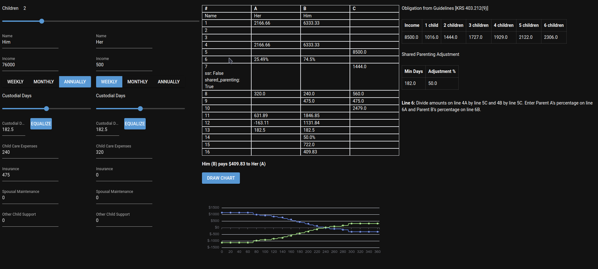

# KY Child Support calculator

Don't ask why.

Run `main.py`, and a browser should open to the [NiceGUI interface](https://nicegui.io/). 
Set your [worksheet](https://www.ardfky.org/sites/ardfky.org/files/Child%20Support%20Worksheet%20CS71.pdf) figures,
and watch the worksheet run itself.

Current for [2024 guidelines](https://apps.legislature.ky.gov/law/statutes/statute.aspx?id=52811).

This should not take the place of your attorney, and has comes with no guarantee of accuracy or fitness-for-purpose.

